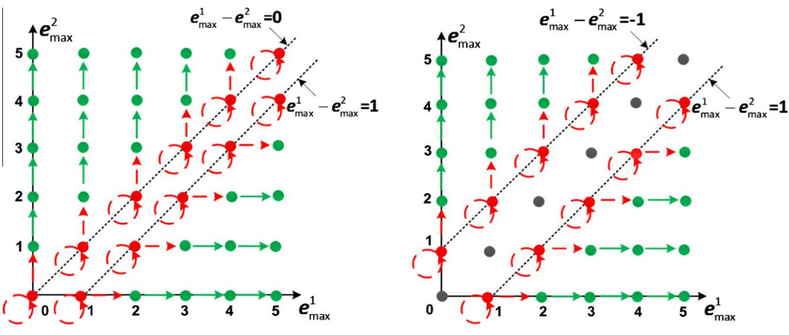
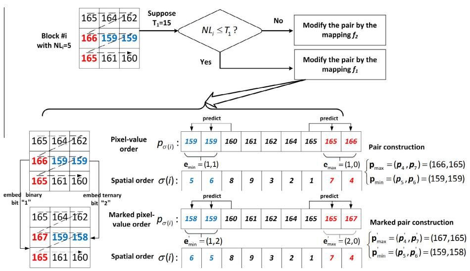
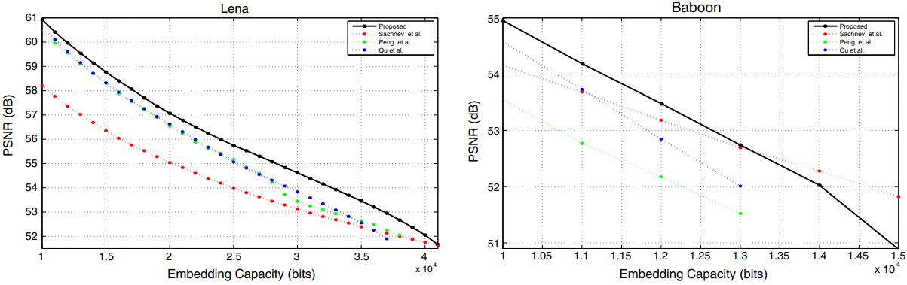
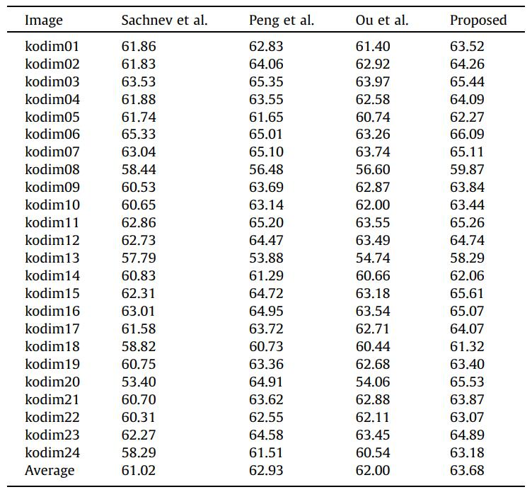

2016-Ou_2D_PVO
=======


This repo is implementation for the accepted paper "[High-fidelity reversible data hiding based on pixel-value-ordering and pairwise prediction-error expansion](https://www.sciencedirect.com/science/article/pii/S1047320316300633)" (JVCIR 2016).


<p align="center">     </p>
<p align="center"> Figure 1: Modification manner on the 2D-PEH.</p>


<p align="center">     </p>
<p align="center"> Figure 2: An example of the proposed PVO embedding.</p>


## How to run

```
go to code
run main_D.m
```

## Experimental Results

<p align="center">     </p>
<p align="center"> Figure 3:  Performance comparison between our method and four methods. </p>

<p align="center">     </p>
<p align="center"> Figure 4:  Performance comparison on Kodak image database.</p>


## Environment
Matlab 2016b <br>


## Acknowledgement
This work is supported by the National Science Foundation of China (Nos. 61502160, 61572052 and 61272421), the PAPD fund and the CICAEET fund.


## Citation
If you find this work useful for your research, please cite
```
@article{OU201612,
title = {High-fidelity reversible data hiding based on pixel-value-ordering and pairwise prediction-error expansion},
journal = {Journal of Visual Communication and Image Representation},
volume = {39},
pages = {12-23},
year = {2016},
issn = {1047-3203},
doi = {https://doi.org/10.1016/j.jvcir.2016.05.005},
author = {Bo Ou and Xiaolong Li and Jinwei Wang},
}
```

## License and Copyright
The project is open source under MIT license (see the ``` LICENSE ``` file).

